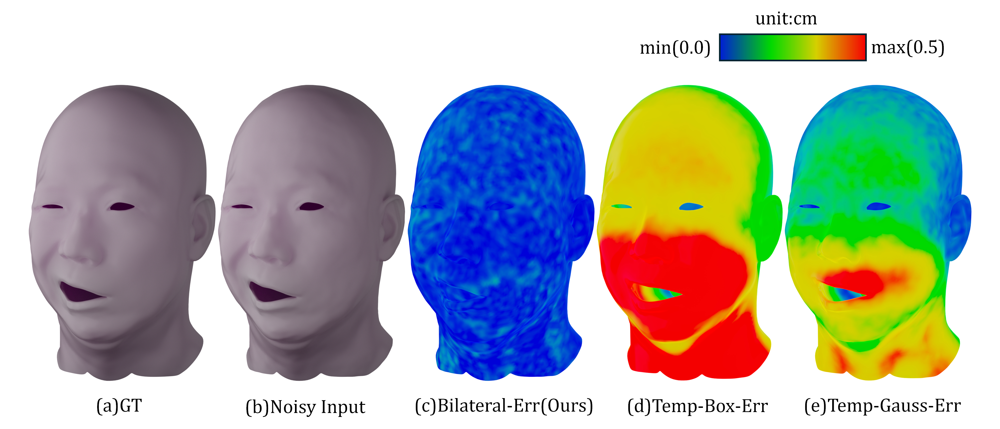

<h1 align="center">Motion-Faithful Denoising for Dynamic Facial Scan Sequences</h1>

<p align="center">
  <a href="https://orcid.org/0009-0004-6081-7618"><b>Jaewon Song</b></a>
  &nbsp;·&nbsp;
  <a href="https://orcid.org/0009-0006-8562-0074"><b>Minyeong Jeong</b></a>
  <br>
  Dexter Studios, Seoul, Republic of Korea
  <br><br>
  <b>SIGGRAPH 2026 Posters</b>
</p>

<p align="center">
  <a href="https://drive.google.com/file/d/1ID2cVOe-SPvKwr3iUn5o9dFroo2txb2D/view?usp=drive_link"></a>
  <a href="https://doi.org/10.1145/3799825.3818714"></a>
  <a href="https://youtu.be/ygYoRAlBmio"></a>
  <a href="https://drive.google.com/file/d/17fW5Wv6yui9yA4fBviCcLQBa1ORGzxRS/view?usp=drive_link"></a>
  <a href="https://creativecommons.org/licenses/by/4.0/"></a>
</p>

<p align="center">
  
</p>

<p align="center">
  <i>Vertex-wise spatial error on a dynamic facial sequence (Subject A, frame 96). Our motion-adaptive bilateral filter (c) keeps error low (blue) across the face, while uniform temporal box (d) and Gaussian (e) filters accumulate large errors (red) around fast-moving regions.</i>
</p>

---

## Abstract

Registered dynamic facial scans, tracked via a template mesh, inherently suffer from **temporal tracking jitter** — a spatially low-frequency but temporally high-frequency error originating from both raw capture noise and registration inaccuracies. Existing spatial and spectral denoising methods fail to address this specific domain mismatch. We present a **motion-adaptive bilateral temporal filter** for fixed-topology 4D Alembic caches that explicitly targets this regime by modulating temporal window size and spatial kernel shape with local motion magnitude. On four facial scan sequences with synthesized tracking jitter, our method reduces temporal acceleration error by **up to 76%** over uniform temporal smoothers while preserving rapid expressions and avoiding the "mushiness" of lag-inducing filters.

## Method

Our framework applies a motion-adaptive bilateral temporal filter directly to registered, fixed-topology geometry caches. The key insight: tracking jitter is **smooth in space but rapid in time**, so we denoise along the time axis and let local motion control the smoothing — erasing jitter in still regions while keeping fast expressions sharp.

The filter behavior is governed by per-frame motion magnitude:

- **Still regions** → wider temporal window (*L* ≈ 11–15) for maximal jitter suppression
- **Fast motion** → narrower window (*L* ≈ 5–7) with sharper spatial weighting to preserve expressions

The method is deterministic, lightweight, and drops directly into existing VFX pipelines, using only per-frame vertex coordinates with no optical flow required.

## Results

Evaluated on four sequences spanning different subjects and motion speeds (24 fps, ~22k vertices). Our method consistently achieves the lowest spatial, velocity, and acceleration error in every case:

| Metric | vs. Temporal Gaussian | vs. Temporal Box |
| --- | :---: | :---: |
| Spatial (vRMSE) | **~70%** ↓ | up to ~85% ↓ |
| Velocity (velRMSE) | **~73%** ↓ | up to ~81% ↓ |
| Acceleration (accelRMSE) | **~73%** ↓ | **up to 76%** ↓ |

Qualitative comparisons on real captured 4D scans are shown in the supplementary video:

<p align="center">
  <a href="https://youtu.be/ygYoRAlBmio">
    
  </a>
</p>

## Downloads

- **📄 Paper (PDF)** — [Download from Google Drive](https://drive.google.com/file/d/1ID2cVOe-SPvKwr3iUn5o9dFroo2txb2D/view?usp=drive_link)
- **🎥 Supplementary Video** — [Watch on YouTube](https://youtu.be/ygYoRAlBmio)
- **💾 Data Sample (Subject A, Alembic cache)** — [Download from Google Drive](https://drive.google.com/file/d/17fW5Wv6yui9yA4fBviCcLQBa1ORGzxRS/view?usp=drive_link)
- **🔗 ACM Digital Library** — [doi.org/10.1145/3799825.3818714](https://doi.org/10.1145/3799825.3818714)

The data sample contains one registered, fixed-topology 4D facial scan sequence from our experiments, provided as an Alembic (`.abc`) cache. **Note:** this is the raw, *jittery* input sequence (before denoising) — the source data that motivates our method. It is shared so that other researchers can reproduce our results or benchmark their own denoising techniques on the same input.

## Citation

If you find this work useful, please cite:

```bibtex
@inproceedings{song2026motionfaithful,
  author    = {Song, Jaewon and Jeong, Minyeong},
  title     = {Motion-Faithful Denoising for Dynamic Facial Scan Sequences},
  booktitle = {Special Interest Group on Computer Graphics and Interactive Techniques Conference Posters (SIGGRAPH Posters '26)},
  year      = {2026},
  location  = {Los Angeles, CA, USA},
  publisher = {ACM},
  address   = {New York, NY, USA},
  pages     = {3},
  doi       = {10.1145/3799825.3818714},
  url       = {https://doi.org/10.1145/3799825.3818714}
}
```

## Acknowledgments

We thank Jaeho Im for serving as the 4D sequence model and Yeonsoo Choi for assistance with mesh error visualization. This research was supported by the Culture, Sports and Tourism R&D Program through the Korea Creative Content Agency (KOCCA) grant funded by the Ministry of Culture, Sports and Tourism in 2025 (Project Name: *Development of automatic digital human creation technology based on historical data*, Project Number: RS-2025-25459094).

## License

This work is licensed under a [Creative Commons Attribution 4.0 International License](https://creativecommons.org/licenses/by/4.0/).

## Contact

For questions or inquiries, please contact: **jaewon.song@dexterstudios.com**
